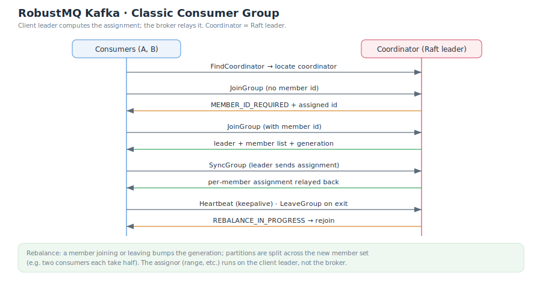

# Consumer Group (Classic Protocol)

A consumer group lets multiple consumers cooperatively consume a topic: each partition is consumed by only one member at a time, and membership changes trigger an automatic **rebalance**. This page covers the **classic protocol** — the full path built on `JoinGroup` / `SyncGroup` / `Heartbeat`. For the next-generation KIP-848 protocol see [Next-Gen Consumer Group](./ConsumerGroupNext.md).

## Coordinator

The group coordinator is the current **meta-service Raft leader**. A client first locates it with `FindCoordinator`, then sends subsequent requests there. A request that reaches a non-coordinator node returns `NOT_COORDINATOR` so the client redirects.

## Full Path

| Step | API | Notes |
|---|---|---|
| 1. Locate coordinator | `FindCoordinator` | Find the coordinator node for the group |
| 2. First join | `JoinGroup` | The first call carries no member id; the coordinator returns `MEMBER_ID_REQUIRED` and assigns one |
| 3. Rejoin | `JoinGroup` | Rejoin with the member id; the coordinator picks one member as **leader** and sends it the member list |
| 4. Sync assignment | `SyncGroup` | The **client leader** computes the partition assignment and uploads it; the broker only **relays** each member's assignment back |
| 5. Maintain membership | `Heartbeat` | Periodic keepalive; when the coordinator starts a rebalance it returns `REBALANCE_IN_PROGRESS` to prompt a rejoin |
| 6. Leave | `LeaveGroup` | Voluntarily leave, triggering a rebalance |

> Key design: **the client leader computes the assignment; the broker only relays it**. The assignor (range, roundrobin, etc.) is decided entirely on the client — the broker does no computation.

## Offset Commit and Resumed Reads

During consumption, a member commits offsets via `OffsetCommit` (`commitSync` commits synchronously and waits for the ack). Offsets are persisted in the meta layer, so:

- When a **new member** takes over a partition, it resumes from that partition's **committed offset** — no re-reads, no gaps (falling back to `auto.offset.reset` when no offset exists).
- Offset lookup, reset, and lag computation are covered in [Offset Management](./OffsetManagement.md).

## Rebalance

A change in the member set triggers a rebalance, re-splitting partitions across the new members:

| Case | Result |
|---|---|
| Two consumers subscribe to the same topic | Partitions split between them (e.g. half each) |
| A member leaves | Its partitions are reassigned to the remaining members |
| A new member joins | The generation increments and partitions are reassigned |

During a rebalance, the coordinator returns `REBALANCE_IN_PROGRESS` on heartbeats; members re-run `JoinGroup` → `SyncGroup` to complete a new assignment.

## Commands and Related Docs

- CLI: `kafka-consumer-groups.sh --describe/--list` to view group state and lag.
- [Offset Management](./OffsetManagement.md)
- [Next-Gen Consumer Group (KIP-848)](./ConsumerGroupNext.md)
- [Consumer](./Consumer.md)
- [System Architecture](./SystemArchitecture.md)
