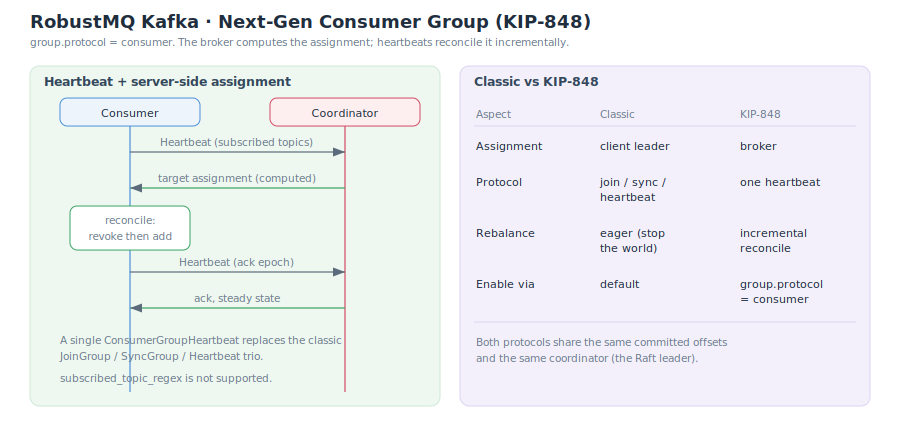

# Next-Gen Consumer Group (KIP-848)

KIP-848 is Kafka's next-generation consumer group protocol. It moves partition assignment from the client to the **server** and replaces the classic protocol's stop-the-world rebalance with incremental heartbeats. RobustMQ supports it: clients enable it by setting `group.protocol=consumer`. For the classic protocol see [Consumer Group](./ConsumerGroup.md).

## Enabling

| Config | Value | Effect |
|---|---|---|
| `group.protocol` | `consumer` | Use the KIP-848 protocol |
| `group.protocol` | `classic` (default) | Use the classic protocol |

## How It Works

The core is a single `ConsumerGroupHeartbeat` that replaces the classic `JoinGroup` / `SyncGroup` / `Heartbeat` trio:

1. **Report subscription** — the consumer's heartbeat carries the list of topics it subscribes to.
2. **Server-side assignment** — the **broker (coordinator) computes** the target assignment and returns it in the heartbeat response. This is the biggest difference from the classic protocol.
3. **Incremental reconcile** — the consumer moves toward the target assignment by revoking then adding partitions incrementally, with no group-wide pause.
4. **Steady-state heartbeat** — once the target assignment is reached, heartbeats carry an epoch to acknowledge it and enter steady state.

## Classic vs KIP-848

| Aspect | Classic | KIP-848 |
|---|---|---|
| Assignment computed by | Client leader | **Server (broker)** |
| Protocol messages | JoinGroup + SyncGroup + Heartbeat | Single ConsumerGroupHeartbeat |
| Rebalance style | Eager (stop-the-world: revoke all, then reassign) | Incremental reconcile (gradual migration) |
| Assignor location | Client | Server |
| Enabled via | Default | `group.protocol=consumer` |

Both protocols **share the same committed offsets and the same coordinator** (the Raft leader), so offset management is identical (see [Offset Management](./OffsetManagement.md)).

## Limits

| Item | Status |
|---|---|
| `group.protocol=consumer` | Supported |
| Server-side assignment + incremental heartbeat | Supported |
| `subscribed_topic_regex` (regex subscription) | **Not supported** |

## Related

- [Consumer Group (Classic Protocol)](./ConsumerGroup.md)
- [Offset Management](./OffsetManagement.md)
- [Consumer](./Consumer.md)
- [System Architecture](./SystemArchitecture.md)
