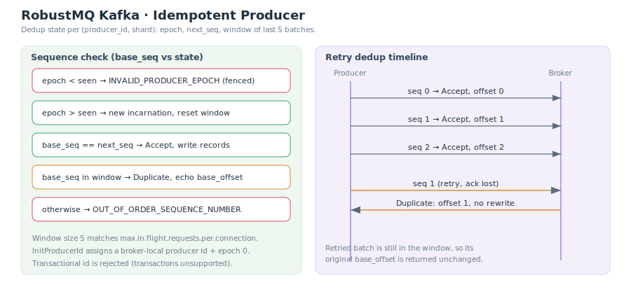

# Idempotence

The idempotent producer guarantees that **a message is not written more than once** when the producer retries. RobustMQ fully supports the default idempotent producer (`enable.idempotence=true`, the default in modern Kafka clients), giving exactly-once write behavior with no extra configuration.

> **Transactions are not supported**: an `InitProducerId` carrying a `transactional_id` is rejected. Idempotence is a subset of transactions; RobustMQ currently offers idempotence only, not cross-partition / cross-session transactions. See [Compatibility and Limitations](./Compatibility-and-Limitations.md).

## How It Works

### Producer ID Allocation

On startup the producer sends `InitProducerId`; the broker allocates a **producer id** and returns epoch 0.

- The producer id is **monotonic per broker** — a node-local range, not a globally coordinated allocation.
- The epoch distinguishes incarnations of the same producer id; a restarted producer arrives with a higher epoch.

### Dedup State

The broker keeps dedup state per `(producer_id, shard)`:

| Field | Meaning |
|---|---|
| `epoch` | The latest producer epoch seen |
| `next_seq` | The expected next base sequence |
| window | The last **5** accepted batches, as `(base_seq, base_offset)` |

The window size 5 matches Kafka's default `max.in.flight.requests.per.connection` — up to 5 in-flight requests, so the broker remembers the last 5 batches to recognize their retries.

### Sequence Decision

Each batch carries a `base_sequence`. The broker decides as follows (source: `check_producer_sequence`):

| Condition | Result | Returns |
|---|---|---|
| `epoch` older than seen | Fenced (stale incarnation) | `INVALID_PRODUCER_EPOCH` |
| `epoch` newer than seen | New incarnation, reset window | Accept and write |
| `base_seq == next_seq` | In order | Accept and write |
| `base_seq` hits a batch in the window | Duplicate (retry) | Return the original `base_offset`, **no rewrite** |
| otherwise (gap ahead, or stale beyond window) | Out of order | `OUT_OF_ORDER_SEQUENCE_NUMBER` |

The key point: **a retry that hits the window returns the original base_offset** and produces no new record, which is what makes it idempotent. After a successful write, `next_seq` advances to `last_seq + 1` and the batch is appended to the window (evicting the oldest beyond 5).

## Relation to the Produce Flow

The idempotence check sits in the produce path "after the size check, before the write" (see [Producer](./Producer.md#write-flow)). A non-idempotent producer (`producer_id < 0`) skips the whole check.

## Limits

| Item | Status |
|---|---|
| Idempotent produce | Fully supported |
| Producer id scope | Broker-local (single node), not a cross-node global range |
| Transactions (`transactional_id`) | Unsupported; `InitProducerId` is rejected |
| Cross-session idempotence | Relies on the producer id/epoch held by the client, per Kafka semantics |

## Related

- [Producer](./Producer.md)
- [System Architecture](./SystemArchitecture.md)
- [Compatibility and Limitations](./Compatibility-and-Limitations.md)
