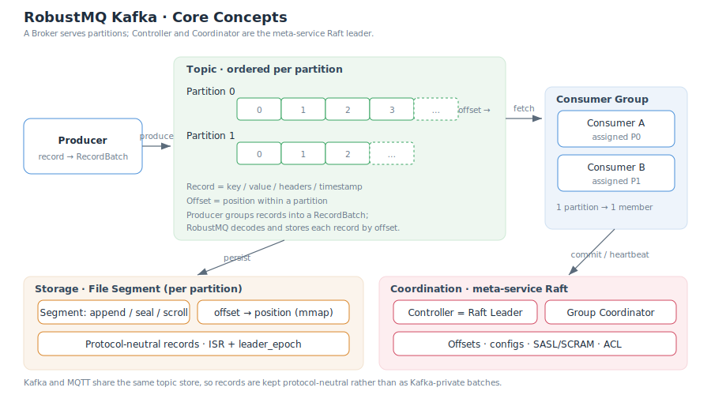

# Core Concepts

This document explains the core concepts of RobustMQ Kafka and how they map onto the unified RobustMQ kernel. If you know native Kafka, these concepts are identical; differences are called out explicitly.

## Topic and Partition

A **Topic** is a logical category of messages; a **Partition** is the topic's unit of parallelism and ordering.

- A topic consists of one or more partitions; ordering is guaranteed only **within a single partition**, not globally across partitions.
- The partition is the basic unit of parallelism: more partitions allow more concurrent producing / consuming.
- In RobustMQ, each partition maps to a storage-layer shard (a sequence of segments) persisted by the File Segment engine.

## Offset

An **Offset** is the position of a record within a partition, increasing monotonically from 0.

- Offsets are assigned by the broker on write — contiguous and immutable.
- Consumption progress is the "committed offset", saved by the consumer group via `OffsetCommit` and read via `OffsetFetch`.
- `ListOffsets` queries the earliest / latest offset or locates by timestamp.

> In RobustMQ, offsets are assigned by the storage layer on write, guaranteeing contiguous increments within a partition.

## Record and RecordBatch

A **Record** is the smallest message unit, containing key, value, headers, and timestamp. A **RecordBatch** is a batch of records the producer packs and compresses together to improve throughput.

RobustMQ has a **fundamental difference** from native Kafka here:

| | Native Kafka | RobustMQ |
|---|---|---|
| Storage form | Stores the compressed RecordBatch as-is | Stores **protocol-neutral, decoded records** |
| Fetch | zero-copy, returns the original batch | Reads records and **reframes** them into a RecordBatch |
| Compression | Preserves the producer's compression encoding | Consumer side always returns **uncompressed** records |

The reason: Kafka and MQTT share the same topic data, so the storage layer must use a neutral format not bound to any single protocol. The cost is giving up Kafka's zero-copy and compression pass-through (see [Compatibility & Limitations](./Compatibility-and-Limitations.md)).

## Producer

A **Producer** writes records to a topic's partitions.

- The target partition is chosen by hashing the key or by an explicit partitioner.
- **Idempotent Producer**: RobustMQ supports idempotent production. `InitProducerId` allocates a Producer ID, and the broker deduplicates using "sequence numbers + epoch fencing" — each `(producer, partition)` keeps a last-5 sliding window, and duplicate batches are safely discarded.
- **Transactional Producer**: not supported. `InitProducerId` with a `transactional_id` returns `TRANSACTIONAL_ID_AUTHORIZATION_FAILED`.

## Consumer and Consumer Group

A **Consumer** pulls records from partitions; a **Consumer Group** is a set of consumers cooperatively consuming the same set of topics.

- Within a group, each partition is assigned to exactly **one** member, providing load balancing and horizontal scaling.
- Members joining / leaving triggers a **rebalance**, reassigning partitions.
- Progress is committed at "group + topic + partition → offset" granularity.

RobustMQ supports both generations of the consumer group protocol:

| Protocol | Related APIs | Assignment by |
|---|---|---|
| Classic | `FindCoordinator` / `JoinGroup` / `SyncGroup` / `Heartbeat` / `LeaveGroup` | Client (group leader) |
| KIP-848 | `ConsumerGroupHeartbeat` / `ConsumerGroupDescribe` | Server (coordinator) |

> KIP-848 does not yet support `subscribed_topic_regex` (regex subscription).

## Broker, Controller, and Coordinator

A **Broker** is the node serving the Kafka protocol: it handles `ApiVersions` / `Metadata` and serves reads/writes for the partitions it owns.

The **Controller** and **Coordinator** are **not** separate components in RobustMQ — they are the **meta-service Raft leader**:

- **Controller**: the controller id returned by `Metadata` / `DescribeCluster` points to the current Raft leader.
- **Group Coordinator**: consumer group membership and offset commits are handled by the coordinator, which is also the Raft leader. `FindCoordinator` returns its address.
- Only the node that is the current Raft leader takes on coordination duties; otherwise it returns `NOT_COORDINATOR` and the client redirects.
- The coordinator address is obtained via a gRPC lookup cached with a ~3s TTL, avoiding a metadata-layer hit on every request.

> Native Kafka uses KRaft / ZooKeeper for the controller role; RobustMQ uses Raft uniformly, eliminating the separate coordination component.

## Segment

A **Segment** is the physical storage unit of the File Segment engine — how a partition lands on disk:

- **append / seal / scroll**: records are appended to the current segment; once a threshold is reached the segment is sealed and rolled (scrolled) to a new one.
- **`offset → position` index + mmap reads**: quickly locate the physical position by offset and read.
- **ISR multi-replica**: segments are replicated across replicas, with `leader_epoch` fencing to block writes from a stale leader.

## Concept mapping at a glance

| Kafka concept | Mapping in RobustMQ |
|---|---|
| Topic / Partition | Topic and shard in the unified kernel |
| Offset | Contiguous sequence assigned by the storage layer on write |
| RecordBatch | Decoded into the store on write, reframed on Fetch |
| Controller | meta-service Raft leader |
| Group Coordinator | meta-service Raft leader |
| Log Segment | Segment of the File Segment engine |

## Further reading

- [System Architecture](./SystemArchitecture.md)
- [Protocol Compatibility Matrix](./Protocol.md)
- [Compatibility & Limitations](./Compatibility-and-Limitations.md)
