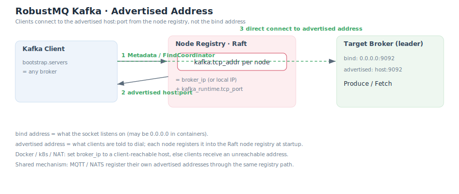

# Advertised Address

A Kafka client connects in "two hops": first to any broker in `bootstrap.servers` to fetch metadata, then **directly** to the target broker (partition leader / coordinator) using the address the metadata provides. So the address a broker tells the client must be **actually reachable** from that client — this is what the "advertised address" solves.

## Bind address vs advertised address

| Concept | Meaning |
|---|---|
| Bind address | What the socket actually listens on. Often `0.0.0.0:9092` in containers. |
| Advertised address | The host:port told to clients via `Metadata` / `FindCoordinator`. |

The two may differ. Clients never use the bind address — only the advertised one.

## How RobustMQ registers and advertises

This is a **shared mechanism across protocols**: at startup a node writes each protocol's external address into the meta layer's **node registry** (`NodeExtend`). Kafka's entry is `kafka.tcp_addr` (MQTT and NATS each have their own fields, going through the same registration / consumption path).

- **Advertised address = `broker_ip` + `kafka_runtime.tcp_port`**.
- When `broker_ip` is unset, the auto-detected local IP is used.
- Both `Metadata` (broker list, partition leaders) and `FindCoordinator` (coordinator) read `kafka.tcp_addr` from the registry to tell clients which node to connect to directly.

## Per-environment guidance

| Scenario | Recommendation |
|---|---|
| Local / dev | The default `broker_ip = "127.0.0.1"` is fine. |
| Multi-host cluster in one subnet | Set `broker_ip` to the node's cluster-reachable IP. |
| Docker | If clients are on the host, set `broker_ip` to a host-reachable address, not the container's internal IP. |
| Kubernetes | Set it to an address reachable by clients for that Service / Pod; each broker needs its own stable, routable address. |
| NAT / public | Set it to the public address reachable from the client side. |

::: warning Common failure
If the advertised address is set to something unreachable from the client (e.g. a container-internal IP, or `127.0.0.1` connected from a remote host), the symptom is usually: **bootstrap connects and metadata is fetched, but the subsequent direct connect to the partition leader / coordinator times out or is refused**. When debugging, first verify the host:port returned by `Metadata` is ping/telnet-reachable from the client.
:::

## Related

- The advertised port comes from `kafka_runtime.tcp_port`, see [Broker Configuration](../Configuration/BrokerConfig.md).
- How coordinators use the registry to resolve, see [Cluster & Controller](./ClusterAndController.md).
- Address setup during deployment, see [Deployment](./Deployment.md).
