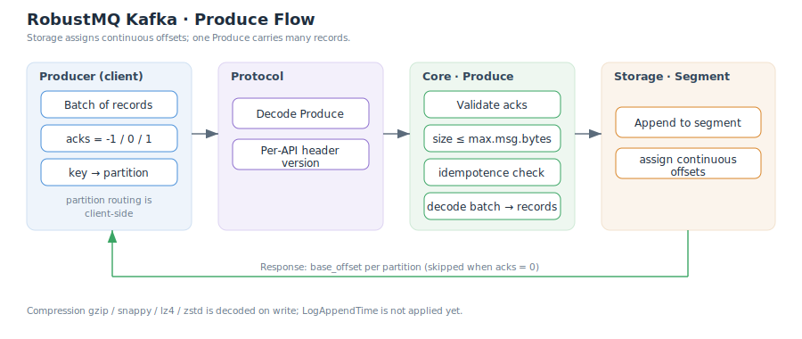

# Producer

Producers write messages to topic partitions through the `Produce` API. RobustMQ is compatible with standard Kafka producers: acks semantics, client-side partition routing, and batched writes all behave per the Kafka protocol. This page describes the write path inside RobustMQ and its current limits.

## Write Flow

The order in which the broker handles one `Produce` request:

1. **Decode** — the protocol layer parses the `ProduceRequest`, which holds several topics/partitions, each carrying one record batch.
2. **Validate** — the core layer checks the acks value, then checks the batch size against `max.message.bytes`.
3. **Idempotence check** — if the batch carries a producer id (idempotent producer), it is deduplicated by sequence number (see [Idempotence](./Idempotence.md)).
4. **Decode into store** — the batch is unpacked into **protocol-neutral records** and appended by the File Segment storage engine.
5. **Assign offsets** — the storage layer assigns offsets on write, incrementing continuously within a batch.
6. **Respond** — each partition returns its `base_offset` (the offset of the batch's first record). With `acks=0` no response is sent.

## acks Semantics

`acks` controls when the broker acknowledges a write to the producer.

| acks | Meaning | Response sent |
|---|---|---|
| `-1` (`all`) | Acknowledge after replicas persist per the storage-layer policy | Yes |
| `1` | Acknowledge once the leader has written | Yes |
| `0` | Do not wait, fire-and-forget | **No** |

> With `acks=0` the producer expects no response and the broker sends none; write failures cannot be observed in this mode.

## Partition Routing

Partition selection happens on the **client side**; the broker only writes to the partition already named in the request:

| Case | Client behavior |
|---|---|
| key present | Hash the key to a fixed partition (keeps same-key ordering) |
| no key | Spread across partitions (round-robin / sticky, per client implementation) |

## Batching and Offset Continuity

A single partition in one `Produce` request may carry **many records**. On write, the storage layer assigns **continuous offsets** to the whole batch, so record order matches ascending offset order. The `base_offset` in the response points at the first record; subsequent records take `base_offset + 1`, `base_offset + 2`, and so on.

## Message Size Limit

The per-batch size limit is governed by `max.message.bytes`, default **1048588** bytes (1 MiB plus batch-header overhead, matching Kafka's default). An oversized batch is rejected before decoding/writing and returns `MESSAGE_TOO_LARGE`.

## Compression

Producer-side compression is **fully supported**: clients may compress batches with gzip, snappy, lz4, or zstd, and the broker decompresses on unpacking.

> **Limit**: because the store keeps decoded records, the consumer-side `Fetch` currently **always returns uncompressed batches** and does not restore the producer's compression codec.

## Known Limits

| Item | Status |
|---|---|
| LogAppendTime | Not applied yet (timestamps use the client CreateTime) |
| Transactional produce | Unsupported (see [Idempotence](./Idempotence.md) and [Compatibility and Limitations](./Compatibility-and-Limitations.md)) |
| Fetch-side compression | Always returns uncompressed |

## Related

- [Idempotence](./Idempotence.md)
- [Consumer](./Consumer.md)
- [System Architecture](./SystemArchitecture.md)
- [Protocol Compatibility](./Protocol.md)
