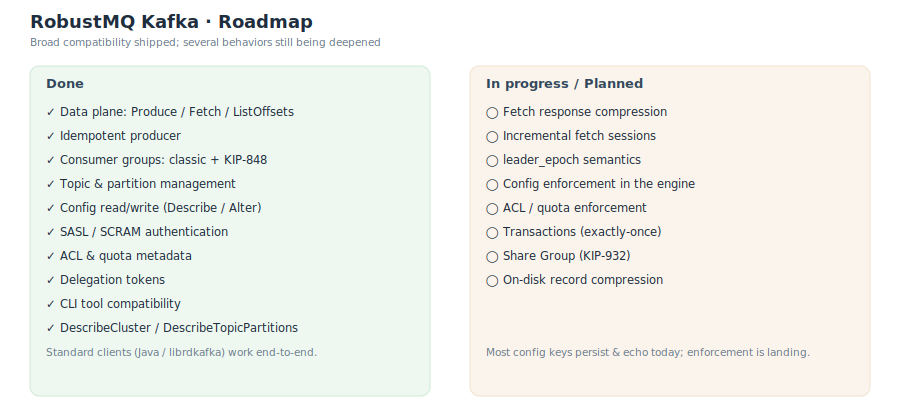

# Roadmap

RobustMQ Kafka already lets standard Kafka clients work end-to-end with fairly broad protocol coverage; at the same time a batch of behaviors keeps deepening (especially "enforcement of config / ACL / quota" and "transactions"). This page gives an honest picture of where things stand.

## Done

| Capability | Notes |
|---|---|
| Data plane | `Produce` / `Fetch` (long poll) / `ListOffsets` |
| Idempotent producer | Deduplicates, avoiding duplicate writes from retries |
| Consumer groups | Classic protocol + next-gen KIP-848 (server-side assignment) side by side |
| Topic management | Create / delete / add partitions |
| Config read/write | `DescribeConfigs` / `AlterConfigs` / `IncrementalAlterConfigs` (store + echo) |
| Authentication | SASL / SCRAM (SHA-256 / SHA-512) |
| ACL / quota | Metadata store/read (not yet enforced) |
| Delegation tokens | Create / renew / expire / describe |
| CLI compatibility | Official `kafka-*.sh` tools work |
| Cluster metadata | `Metadata` / `DescribeCluster` / `DescribeTopicPartitions` |

## In progress / Planned

| Capability | Notes |
|---|---|
| Fetch compression | Compression encoding in `Fetch` responses |
| Incremental fetch session | Reduces full metadata transfer |
| `leader_epoch` semantics | More complete leader epoch fencing / validation |
| Config enforcement | Make stored topic config (e.g. `retention.ms`, `cleanup.policy`) actually drive engine behavior |
| ACL / quota enforcement | From "metadata only" to runtime enforcement |
| Transactions | Exactly-once transactional semantics |
| Share Group | KIP-932 shared consumption model |
| On-disk compression | Record compression in the storage layer |

## Reading "stored but not enforced"

Many of RobustMQ's control-plane capabilities follow a "metadata first" cadence: the API, persistence, and echo land first (clients read/write normally, CLIs display normally), and behavior enforcement follows. Therefore:

- **Config**: `AlterConfigs` writes and `DescribeConfigs` echoes the dynamic source correctly, but most keys are currently stored only and do not yet change engine behavior in full. See [Topic Configuration](./Configuration/TopicConfig.md).
- **ACL / quota**: rules can be stored/read, but runtime enforcement is still planned.

Related: [System Architecture](./SystemArchitecture.md) · [Protocol Compatibility](./Protocol.md) · [Topic Configuration](./Configuration/TopicConfig.md).
