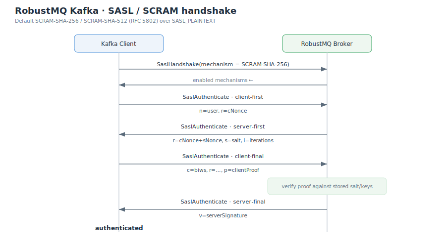

# SASL/SCRAM Authentication

Client authentication in RobustMQ Kafka is based on SASL, with **SCRAM-SHA-256** and **SCRAM-SHA-512** supported by default (per RFC 5802). Once enabled, a connection that has not completed authentication may send only handshake-related requests; everything else is rejected.

## Handshake sequence



1. **SaslHandshake**: the client picks a mechanism. The broker accepts it only if it is both in the configured list and a SCRAM mechanism the broker actually implements; otherwise it returns `UNSUPPORTED_SASL_MECHANISM` and echoes the available mechanisms.
2. **SaslAuthenticate · client-first**: the client sends `n,,n=<user>,r=<cNonce>` (only the `n,,` gs2 header is accepted — no channel binding, no authzid). If the user does not exist, the broker returns the exact same generic failure as a bad password, to prevent user enumeration.
3. **SaslAuthenticate · server-first**: the broker returns `r=<cNonce+sNonce>,s=<salt>,i=<iterations>` (server-generated nonce).
4. **SaslAuthenticate · client-final**: the client sends `c=biws,r=...,p=<clientProof>`. The broker verifies the proof against the stored `StoredKey`.
5. **SaslAuthenticate · server-final**: on success the broker returns `v=<serverSignature>`, the connection becomes authenticated, and the principal is that username.

## Credential management

The server stores only keys derived from the password — **never the plaintext password, nor the SaltedPassword**:

| Field | Meaning |
|---|---|
| `mechanism` | `1` = SCRAM-SHA-256, `2` = SCRAM-SHA-512 |
| `iterations` | iteration count, enforced `>= 4096` |
| `salt` | random salt |
| `stored_key` | `H(HMAC(SaltedPassword, "Client Key"))` |
| `server_key` | `HMAC(SaltedPassword, "Server Key")` |

`DescribeUserScramCredentials` returns only the mechanism and iteration count — **never the salt or keys**.

Manage credentials with kafka-configs (carried by `AlterUserScramCredentials`):

```bash
# Add/update the SCRAM-SHA-256 credential for user alice
kafka-configs.sh --bootstrap-server localhost:9092 \
  --alter --entity-type users --entity-name alice \
  --add-config 'SCRAM-SHA-256=[iterations=8192,password=alice-secret]'

# Delete
kafka-configs.sh --bootstrap-server localhost:9092 \
  --alter --entity-type users --entity-name alice \
  --delete-config 'SCRAM-SHA-256'
```

Credentials are written and persisted through meta-service Raft, then broadcast to every broker's cache; brokers also load the full set once at startup (see [Overview · Persistence path](./Overview.md#persistence-path)).

## Client configuration

```properties
security.protocol=SASL_PLAINTEXT
sasl.mechanism=SCRAM-SHA-256
sasl.jaas.config=org.apache.kafka.common.security.scram.ScramLoginModule required \
  username="alice" password="alice-secret";
```

Enable SASL on the server:

```toml
[kafka.sasl]
enabled = true
mechanisms = ["SCRAM-SHA-256", "SCRAM-SHA-512"]
```

## Limitations

| Limitation | Detail |
|---|---|
| SCRAM only | no PLAIN / OAUTHBEARER / GSSAPI (Kerberos); other mechanisms cannot be added via config |
| No re-authentication | KIP-368 is deferred; the server sets no `session_lifetime` (returns 0, i.e. no forced re-auth window) |
| No transport encryption | this is `SASL_PLAINTEXT`, without TLS; password-derived material is protected by the SCRAM protocol, but the channel itself is not encrypted |
| Single-tenant auth view | credentials are tenant-scoped in storage, but the broker's auth lookup path uses the default tenant |

> ACL authorization is not yet enforced, so a successful authentication is not further gated by ACLs — see [ACL Authorization](./Authorization-ACL.md).
