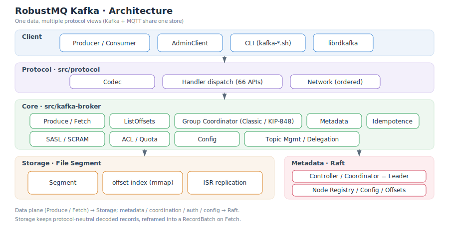

# System Architecture

RobustMQ's Kafka capability is not a standalone Kafka service, but a **Kafka protocol compatibility layer** built on top of the unified RobustMQ kernel. It reuses RobustMQ's networking framework, the File Segment storage engine, and the Raft-based metadata service, and presents itself to the outside world as a standard Kafka broker — native Kafka clients and the official command-line tools connect to it directly.

Its most important design choice is **"one data, multiple protocol views"**: Kafka and MQTT share the same topic store and metadata. The storage layer therefore holds **protocol-neutral, decoded message records** rather than any single protocol's private byte format. This choice drives many implementation decisions later on (for example, why it does not adopt Kafka's "store the compressed batch verbatim" model).

## Layered Architecture

Top to bottom, there are five layers:

### 1. Client Layer

Any standard Kafka client can connect: Java `kafka-clients` (Producer / Consumer / AdminClient), the official CLI tools (`kafka-topics.sh`, `kafka-console-producer.sh`, `kafka-consumer-groups.sh`, etc.), and librdkafka-based clients. A client negotiates the available APIs and versions with the broker via `ApiVersions`, then sends and receives requests accordingly.

### 2. Protocol Layer (`src/protocol`)

Kafka wire-protocol **encoding/decoding**, based on `kafka-protocol` 0.17. Key points:

- **Response header version is derived per API**: the version at which each API becomes flexible (with tagged fields) differs, so it cannot be hard-coded. The protocol layer computes the header version from each response type's own `header_version(api_version)`; otherwise a non-flexible response (such as Produce v7) would get one extra byte and the client would misparse it.
- **Handler dispatch** (`command.rs`): routes each request to its handler by API key, currently covering 66 Kafka APIs.
- **Network layer**: requests are sharded by connection so responses on a single connection stay strictly ordered (Kafka clients pair responses by correlation_id, but ordering avoids a class of races).

### 3. Core Layer (`src/kafka-broker`)

Where the Kafka semantics live:

- **Data plane**: `Produce` (with idempotence), `Fetch` (long-poll), `ListOffsets`.
- **Consumer groups**: the classic protocol (`FindCoordinator` / `JoinGroup` / `SyncGroup` / `Heartbeat` / `LeaveGroup`) and the next-generation KIP-848 protocol (`ConsumerGroupHeartbeat`, server-side assignment) coexist.
- **Metadata & management**: `Metadata`, `DescribeCluster`, topic create/delete/expand, config read/write.
- **Security**: SASL/SCRAM authentication, ACLs, client quotas, delegation tokens.

### 4. Storage Layer (File Segment engine)

Accessed through `StorageDriverManager`:

- **Segment**: append-only, sealed and scrolled to a new segment when thresholds are reached.
- **offset→position index + mmap reads**: locate the physical position by offset.
- **ISR replication**: multi-replica replication, with `leader_epoch` fencing.

Storage holds decoded records: Kafka `Produce` explodes the batch on write, and `Fetch` reframes a `RecordBatch` on read. The same topic is therefore also readable/writable by other protocols such as MQTT — the foundation of cross-protocol interoperability.

### 5. Metadata Layer (meta-service · Raft)

Cluster metadata is managed by the Raft-based meta-service:

- **Controller / Coordinator is the Raft Leader**: Kafka's controller id, the consumer-group coordinator, and the transaction coordinator all resolve to the current Raft leader (via a gRPC lookup cached with a ~3s TTL).
- **Node registry**: each node registers its externally-reachable addresses (see [Advertised Listeners](./Operations/AdvertisedListeners.md)) for `Metadata`/`FindCoordinator` to hand back to clients.
- **Dynamic config & offsets**: cluster dynamic config (e.g. `auto.create.topics.enable`), consumer-group offsets, and ACL/SCRAM/quota data are all persisted here and hot-updatable.

## Request Flow

- **Data plane (Produce / Fetch)**: protocol layer decodes → core layer processes (idempotence check, size check) → storage layer writes/reads → response assembled. The storage layer assigns contiguous offsets on write.
- **Metadata / coordination / auth / config**: protocol layer decodes → core layer processes → reads/writes the Raft metadata layer. Only the current Raft leader (coordinator) takes on coordination duties; otherwise it returns `NOT_COORDINATOR` so the client redirects.

## Key Differences from Native Kafka

| Aspect | Native Kafka | RobustMQ |
|---|---|---|
| Storage unit | stores the compressed RecordBatch verbatim (zero-copy Fetch) | protocol-neutral decoded records, reframed on Fetch |
| Controller | KRaft / ZooKeeper | meta-service Raft leader |
| Multi-protocol | Kafka only | Kafka / MQTT share the same data |
| Transactions | supported | not yet supported (see [Compatibility & Limitations](./Compatibility-and-Limitations.md)) |

> For per-API support status, see the [Protocol Compatibility Matrix](./Protocol.md).
