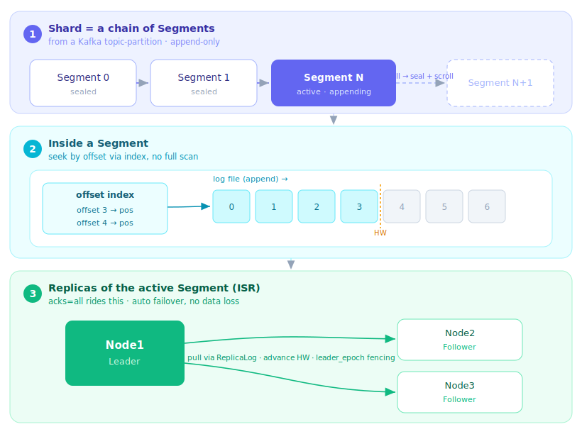

# 唠唠 RobustMQ 的 Kafka 最近搞了啥

最近一直闷声在做 Kafka 这条线，这篇当个进展汇报，随便聊聊。简单说，现在 Kafka 从"能收发消息"走到了"随便找个真实的 Kafka 客户端连上来，元数据、找协调者、加入消费组、提交位点、建 topic、认证这些主线都能跑下去"。不过都还是第一版，只实现了最基础的功能。

## 至今为止，Kafka 走到哪了

Kafka 协议监听独立的端口 `9092`，编解码用社区的 `kafka-protocol`，请求进来按 API key 分发。最早只有 Produce / Fetch / ListOffsets / Metadata 这条收发主干，算是站住了脚。这段时间铺开了不少，现在能跑下去的大致是这些：

- **收发主干**：Produce / Fetch / ListOffsets，配上 Metadata、DescribeCluster、DescribeTopicPartitions 这套集群元数据。
- **消费组**：经典协议那 8 个接口（FindCoordinator / Join / Sync / Heartbeat / Leave / Describe / List / Delete）全做了，KIP-848 新协议（ConsumerGroupHeartbeat / Describe）也做了，新老并存。协调者钉在 Raft leader 上。
- **位点**：OffsetCommit / OffsetFetch，位点落统一的 meta 存储。
- **Topic 管理**：CreateTopics / DeleteTopics / CreatePartitions / DeleteRecords；再加自动建 topic，做成了集群维度的动态配置，运行时热开。
- **存储**：日志落在 storage engine 的 File Segment 分段存储上，接着 ISR 多副本，`acks=all` 能正确提交。
- **安全**：ACL 三件套、SASL/SCRAM 认证、客户端配额、SCRAM 凭据管理。大多还只是元数据加认证的骨架，实际限流这类"生效层"还没接。
- **验证**：用 rdkafka（Rust 的 Kafka 客户端）连真实 broker 跑端到端集成测试，拉元数据、建 topic、自动建 topic 这些主线都验过。

听着不少，其实大多是第一版，只搭了骨架，深度还得慢慢补。挑几块细说。

## 消费组：协调者放 Raft leader 上

消费组是 Kafka 最复杂的部分。我们的做法是协调者不单独搞迁移逻辑了，直接放在 meta-service 的 Raft leader 节点上，leader 选举切到哪，协调者就在哪，省心。

客户端通过一个 Kafka 专属的 meta gRPC 拿当前 leader，`FindCoordinator` 直接返回；打到非协调者节点的组请求，统一回 `NOT_COORDINATOR` 让它重定向。

在这个底座上，经典消费组那 8 个接口全做了：FindCoordinator、JoinGroup、SyncGroup、Heartbeat、LeaveGroup、DescribeGroups、ListGroups、DeleteGroups。老协议的坑是真多，随手举几个：JoinGroup 阶段得用 rebalance 超时批量收人、人到齐了提前收场；没重新入组的僵尸成员得在 rebalance 完成时踢掉，不然可能选出一个联系不上的 leader、把整组挂死；卡在 SyncGroup 里的成员，新一轮 rebalance 开始时得叫醒它。这些都是不做就偶发抽风、做了才可预期的活。

然后顺手把 KIP-848 那套新消费组协议也做了（`ConsumerGroupHeartbeat` / `ConsumerGroupDescribe`）。这是 Kafka 这几年消费组最大的改版，Join/Sync/Heartbeat 三个来回合并成一个心跳，分配改成服务端算，靠三个 epoch 做增量对账。我们实现了服务端的 range 分配器，而且严格"先撤后授"：一个分区非得等前一个持有者确认放手了，才发给下一个成员，绝不让俩消费者同时以为分区归自己。新老两套协议一个 broker 上并存，一个 group 归其中一套。

这里有个很细节的兼容问题：KIP-848 线上用 16 字节 UUID 当 topic id，而我们内核的 topic id 是另一种字符串。改存储太重，干脆拿 topic 名字确定性地派生一个 UUID（同一个 topic 在所有节点、重启前后都是同一个 id），在协议边界上把这层不兼容抹平。

## 存储：Kafka 的日志落在 storage engine 的 File Segment 上

聊下存储层。Kafka 的消息最终得写到盘上，而我们没为 Kafka 单独造一套存储，它复用的是 RobustMQ 内核统一的 storage engine。我们一直讲的"一份数据、多协议视图"就体现在这儿：Kafka 的 topic-partition 往下就是内核的 shard，日志落在 File Segment 引擎上。

File Segment 就是 Kafka 那套经典的分段日志思路，我们自己实现了一遍：

- 一个 shard 不是一个大文件，而是切成一段段（segment），段的命名就是 `{shard_name},{段号}`。写入永远追加到当前活跃段的尾部，顺序 append，这是这类存储快的根本。
- 每段配一个 offset 到文件位置的索引。读的时候不用从头扫，按 offset 直接跳到段内的字节位置，读路径用 mmap 省一次拷贝。除了按 offset，还支持按 key、按 tag 读。
- 当前段写到 `max_segment_size` 就封段（seal）并滚动（scroll）到下一段，段号加一，新写入落到新段。老段封上之后就只读了，过期清理、删除都以段为单位，删一个 shard 就是把它名下的段一次清掉，比逐条删干净利落。
- 关键的位置信息，log start offset、HW、LEO，都持久化，broker 重启后能从盘上恢复，不会丢消费位置。

再往上，这套分段存储是接着 ISR 多副本机制的：三副本的 shard 会把段真实放到三个节点上，follower 通过统一的 `ReplicaLog` 抽象从 leader 拉段日志、推进 HW；leader 挂了自动切主，`leader_epoch` 单调递增做 fencing，已提交的数据一条不丢。所以 Kafka 的 `acks=all` 不是我们在协议层单独糊的，而是直接吃到了 storage engine 这套副本能力。Kafka 视图只管协议语义，存储和高可用都甩给下面统一的引擎。

顺带修过几个存储侧的坑：换段时新段 leader 的 offset 缓存是冷的、差点从 0 开始写（后来把 offset 缓存按 segment 而不是 shard 名来 key）；单条记录超限会让消费停住；保留期在数据量小的时候会卡死。这些都不产生新功能，但让 Kafka 的存储从"能写"往"扎实"走了一截。

## 统一存储的好处：MQTT 和 Kafka 天然互通

存储共享这一件事，带来一个几乎白捡的能力：同一个 topic，MQTT 写进去 Kafka 能消费，Kafka 写进去 MQTT 也能订到。而且不用配桥、不用装 connector，默认就是通的。

原因很简单，全系统只有一套 topic 存储，MQTT 和 Kafka 都是按 `(租户, topic 名)` 去同一个地方查，同名就是同一个 topic，指向同一串 shard、同一份记录。协议只是搭在这份数据上的不同视图，MQTT 按它的方式订阅推送，Kafka 按 offset 拉取，底下读写的是同一份日志。消息只存一份，不是 MQTT 存一份、Kafka 再拷一份。

有个现成的例子：用 Kafka 客户端拉元数据的时候，`$SYS/...`、`$retain-message`、`$delay-queue-message` 这些明明是 MQTT 侧的系统 topic，照样出现在 Kafka 的 topic 列表里，因为它们本来就在同一个 topic 空间里，Kafka 视图看得见。互通不是额外做的功能，而是这套架构的自然结果。

传统方案里要打通 MQTT 和 Kafka，得在中间架一个 bridge 或 connector，把消息从一个系统搬到另一个系统，多一份存储、多一跳延迟、多一处会坏的地方。RobustMQ 这儿省掉了这整层。

有一点要说清楚：打通的是数据这一层，两个协议对"一条消息"的建模并不一样。Kafka 的记录有 key、headers、offset，MQTT 有 QoS、retain 这些概念，两边的语义怎么无损映射（比如 MQTT 的属性怎么落成 Kafka 的 header），还在打磨。但数据本身天然共享、跨协议不用搬运这个底座是默认成立的。

## 聊聊 rebalance：这套架构其实不需要它

用过 Kafka 的都知道扩缩容有多疼。分区（partition）是绑死在一组固定 broker 上的，加了新节点，老分区不会自己挪过去，你得手动做 partition reassignment，把整个分区的数据从旧 broker 搬到新 broker。分区一大、数据一多，这个搬迁又慢又占带宽，还容易把线上抖出问题，是 Kafka 存储弹性的老大难。

RobustMQ 这套架构在存储这一层基本绕开了这个问题。原因就在上一节说的 segment 分段存储：一个 shard 不是一整块绑死在固定节点上的分区，而是一串 segment，每个 segment 放在哪几个节点、谁当 leader，是 meta 层单独决定的。

于是弹性就变成了很自然的事：

- 加一个新节点，新滚动出来的 segment 会按均衡策略落到它上面，不用搬历史数据，增量自然就流过去了。meta 层按每个节点的副本数、leader 数来挑放置位置，越空的节点越优先。
- meta leader 上常驻一个 segment leader 再均衡的控制器，盯着 leader 分布，谁偏了就把 leadership 挪回它该在的副本上，让读写压力长期摊平。这个再均衡是存储层内部、segment 粒度的，客户端完全无感，也不用搬整块分区。
- 真要迁移历史数据也是段粒度的，一段一段来，不是整个分区一把梭，代价小得多。

所以 Kafka 那种"扩容等于一次沉重的分区重分配"，我们这儿基本不需要，弹性下沉到了存储层，靠 segment 的放置和 leader 再均衡自然完成。

要说清楚的是，这里说的是存储和 broker 侧的弹性，跟消费组的 rebalance（把分区分给一组消费者）不是一回事，后者该有还得有，我们经典协议和 KIP-848 两套都实现了。这两个 rebalance 经常被混在一起，其实是两层的事。

## 计划和展望

往后看，Kafka 这条线真正想做成的是三件事。

一是把 IoT 和大数据打通。MQTT 是 IoT 那头的事实标准，海量设备往上报数据；Kafka 是大数据这头的事实标准，流处理、数仓、实时分析都在它下游。传统架构里这两个世界是靠一串 bridge/connector 拼起来的，设备数据先进 MQTT broker，再由某个桥搬进 Kafka，才能进大数据管线，中间多一层存储、多一段运维。而在 RobustMQ 里，前面聊过的"同一个 topic、MQTT 写 Kafka 读"本来就成立，设备用 MQTT 把数据打进来，大数据侧直接用 Kafka 消费者拉走，不用搬运。一份数据，设备侧和分析侧各看各的视图。

二是边缘和云一体。IoT 的数据往往先落在边缘，再汇聚到云。既然同一套内核能同时讲 MQTT 和 Kafka，那边缘用 MQTT 接设备、云端用 Kafka 做分析就能跑在同一套技术栈上，而不是边缘一套、云端一套、中间再拿工具缝。边缘和云共用一份数据模型、一套运维方式，是我们想验证的一条路。

三是把 Kafka 内核的功能和稳定性做扎实。前面反复说了，现在铺的是面，深度还没跟上。接下来重心会往深走：认证授权（ACL / SASL）铺开、配额的实际限流接上、事务和 KIP-932 Share Group 这些大块补齐、存储侧的性能和过期压缩策略打磨，还有 admin 接口的边角。愿景再好，也得靠内核一行行夯实来兑现。

Kafka 对 RobustMQ 不是多支持一个协议，是把 IoT 和大数据这两个原本靠搬运才连得起来的世界，收进同一份数据。才刚开头，慢是慢了点，好在每步踩得住。下次再聊。
