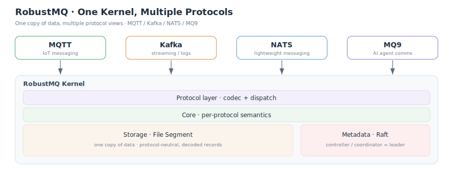

# Kafka 协议的 Rust 实现，来了

哈哈哈哈，挺兴奋的，RobustMQ 的 Kafka 协议来了。不过这绝对不仅仅是又一个 Kafka 的 Rust 重写。它的定位是 RobustMQ 上的一层 Kafka 协议兼容层。RobustMQ 最新的愿景是“”，一直想做的是 All in One 的消息队列，一套内核，多种协议，Kafka 只是其中之一。这套内核上原来跑的是 MQTT，现在把 Kafka 协议也接了进来，加上MQ9和Nats，满打满算支持了四个协议了

这是第一个版本。标准的 Kafka 客户端、官方的命令行工具都能直接连上来用、能测，但离生产可用还有不小的距离。写这篇是跟大家分享一下现在的进展。对我们来说，这一版更多是拿来验证架构的：同一套内核、同一份数据，能不能既做 MQTT，又把 Kafka 跑起来。目前看是能的。

## 现在走到哪一步

Kafka 核心的生产、消费，以及Offset的提交和查询、幂等都支持了。消费组新旧两套协议都支持。旧的那套，分区怎么分是客户端算的；新的这套（KIP-848）把分区分配挪到了服务端。两套并存，客户端用哪套都行。主题的建、删、加分区都能用，默认开着自动建主题。配置的读写、SASL/SCRAM 认证（SHA-256 和 SHA-512）、集群和主题的元数据查询，也都通了。协议这一层现在能认 66 个 Kafka 接口。

有些还没做，或者只做了部分：

1. 不支持事务
2. 不支持Kafka 4.0 新出的共享消费组（KIP-932）。
3. 消费端现在拿到的是没压缩的消息，增量拉取会话、读已提交这些也还没有。
4. 权限、配额、还有一部分主题配置，现在能存、能查、能显示出来，但运行时还不会真正拦截和限制。
5. 副本搬迁、日志目录、手动切主这些运维接口不需要了。这些交给存储层和 Raft 自己管。

至今为止，做了几轮测试。一套两百来个用例的集成测试，在三节点集群上跑，把收发、消费组、位点、配置、认证都覆盖了。一套用 Kafka 官方 Java 客户端写的测试，直接连上来验证收发、消费组、删记录、配置、委托令牌这些。官方那些命令行工具也一个个过了：建主题、控制台收发、看消费组、查位点、改配置、权限、委托令牌、看接口版本，都能直接操作 RobustMQ。另外还做了三节点的故障切主演练和副本同步演练。

## 系统架构

它不是一个单独的进程，是内核上的一层协议兼容层。从上到下大概五层：

最上面是客户端，标准 Kafka 客户端直接连，默认端口 9092。往下一层管协议的编解码，按接口把请求分发下去。再往下是核心层，Kafka 的语义都在这里：收发、位点、消费组协调、元数据、认证。核心层下面是存储层，也就是 File Segment 引擎。最底下是元数据层，由 Raft 管着整个集群的元数据。

贯穿这套结构的是一个想法：一份数据，多个协议来看。Kafka 和 MQTT 共用同一份主题存储和元数据。消息写进来的时候拆成一条条记录存下，消费的时候再拼回 Kafka 要的格式。所以同一个主题，MQTT 也能读能写。这既是它能做的事的来源，也是前面那些限制的根子。

## 核心技术特点

1. 元数据用 Raft。整个集群的元数据由 Raft 管着，Kafka 里的控制器、消费组的协调者这些"谁说了算"的角色，没有再单独搭一套，而是谁是 Raft 的主节点，谁就来当，查一次缓存几秒钟。所以既不需要 ZooKeeper，也不需要 KRaft，选主这件事 Raft 本来就在做。

2. 存储层。Kafka 协议的底层是 File Segment 引擎，顺序追加，写满一段就封存、另开一段，靠一份从位点到物理位置的索引配合内存映射来读，多副本之间用epoch 防止老的主节点乱写。

3. 消费组的 Rebalance，新旧两套都在。旧协议里分区怎么分是客户端选出来的成员算的，服务端只做中继，分区一变整组停下来重分；新协议（KIP-848）把分配挪到服务端，一次心跳带下目标分配，消费者增量地先放旧的、再接新的，不用全组停顿。

4. 数据的 Rebalance，不靠搬分区。这跟上面消费端那个是两回事。传统 Kafka 摊负载要做分区副本重分配，把整个分区的日志从一个节点搬到另一个，慢也占带宽。我们不搬：分区切成一段段，旧段封存不可变，在写的只有活跃段；要平衡就在申请新段时，由 meta-service 把新段放到合适的节点上。粒度从整个分区细到一个段，跟着段滚动自然发生，不停机、不搬历史数据。

5. 多副本同步，照 Kafka 的 ISR 做。写先到 leader，其它副本跟它同步，跟上的才算在 ISR 里。`acks=all` 时 ISR 不够（低于 min_in_sync_replicas）就直接拒写，还要等高水位推过这次写入才算成功。leader 换任按 epoch 定截断点，防止脑裂写岔。语义和 Kafka 对齐。

6. 性能，靠两样东西打底。一是 Rust，没有 GC 停顿，内存和线程自己精确控制；二是 append-only 的写入模型，活跃段只顺序写、不随机写，读写路径都短。这版还没到细抠性能的阶段，但底子是照这个方向搭的。

## 接下来做什么

再往后想试试 AMQP。AMQP 应该会是 RobustMQ 验证其是否具备ALL in One 架构的最有一个协议了。因为它的模型跟 Kafka、MQTT 都不一样，拿它继续验证这套架构，更能说明"一份数据、多协议"这条路走不走得通。

Kafka 这边也接着补功能，完善测试用例，再慢慢补其他部分，不追求一口气铺满：

1. 配置从"能存"到"真生效"：保留时长、清理策略这些要真的驱动引擎。
2. 权限参与鉴权，配额参与限流。
3. 消费端补上压缩、增量拉取会话。
4. leader epoch 语义做得更完整。
5. 事务、共享消费组，这两块要动更底层的存储和状态机，是更长线的事。

## 最后

消息队列现在是协议割裂的。物联网用 MQTT，数据管道用 Kafka，微服务用 AMQP，一家公司常常同时养着好几套，各有各的部署、监控、运维，坑也不通用，人和机器都在重复投入。RobustMQ 想换个思路：底下一套内核、一份存储，上面按协议给出不同视图，用哪个协议连上来就是。一份数据多个协议读写，也省了多套系统之间同步状态的麻烦。

顺着这思路，MQTT 先跑起来了。但一个协议说明不了太多，MQTT 相对轻。Kafka 重、生态大、客户端行为也复杂，分区、消费组、位点、幂等，每样都对底下的存储和协调有实打实的要求。所以拿它来压架构：Kafka 能在这份"跟协议无关"的存储上端到端跑通，就说明"一份数据、多协议"不只对 MQTT 成立，是真立得住。这一步现在走通了。

还有一个方向更能说明问题：不光是把别人的协议搬进来，RobustMQ 上还长出了一个全新的协议——mq9，给 AI Agent 之间用的。Agent 注册自己、按语义发现别人、可靠收发消息，注册中心直接做进 broker 里。它不是对某个现成标准的兼容层，是在这套内核上自己长出来的新形态。这比多支持一个协议更进一步：底下这套架构撑得住的，不只是已有的协议，也包括以前没有的东西。

跑通不等于好用。前面那些没做的、没强制生效的地方，都是实打实的距离，得一个个补，但方向上会有信心一点了。
