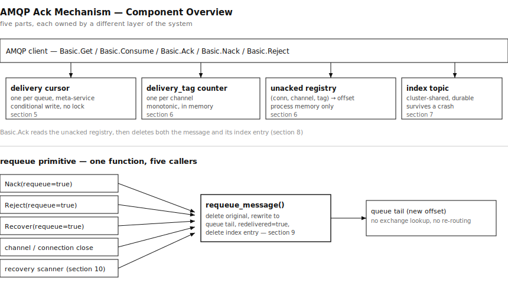
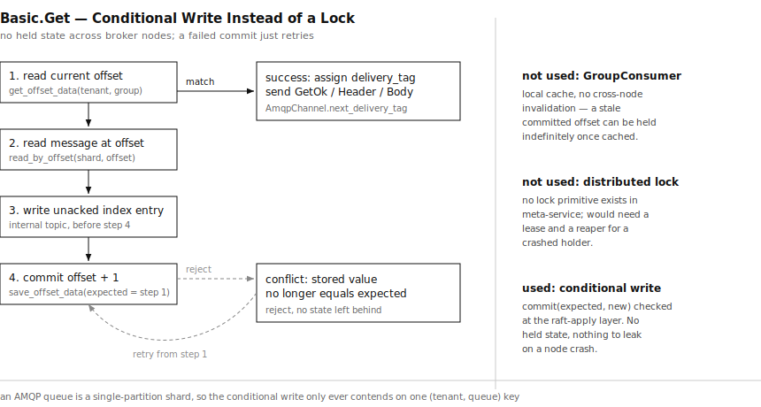
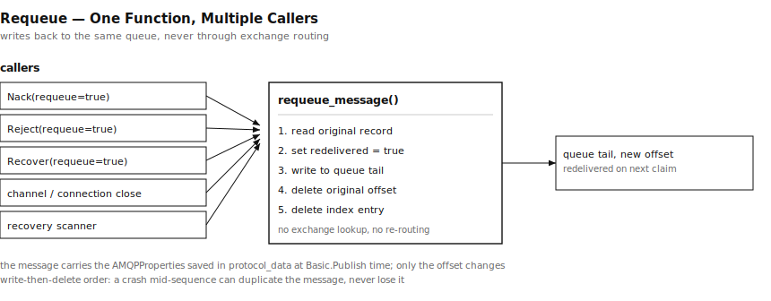
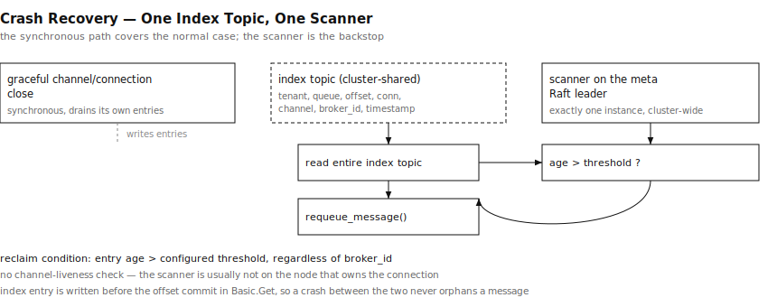

# AMQP 的 Ack，怎么落在 RobustMQ 的存储模型上

Kafka 那条线聊完之后，AMQP 是验证"一份数据、多协议视图"这套架构剩下的最后一块。它跟 Kafka、MQTT 都不一样：Kafka 靠位点提交，commit 不等于删除，一份日志能被好几个消费组各读一遍；AMQP 的 queue 是取走即删除，一条消息只能落到一个消费者手里，还得支持显式的 ack、nack、requeue。这篇讲 ack 在 RobustMQ 里怎么落地，包括为了扛住多 broker 节点这个前提，中间推翻过几版方案。

## 先把 AMQP 的 ack 语义摆清楚

AMQP 没有消息 ID 这回事。`AMQPProperties.message_id` 是发布者自己设的，broker 根本不解析，纯粹给应用层自己用。真正定位一次 ack 的是 `delivery_tag`，broker 在投递那一刻（`Basic.Deliver` 或 `Basic.GetOk`）临时分配的一个整数，作用域是 channel，不是 queue，也不是消息本身。同一个 channel 上不管消费的是哪个 queue，delivery_tag 用的是同一套递增序号，channel 一开从 1 起，只增不减，channel 关掉整个计数器跟着消失，不需要在 ack 的时候单独清理。

`no_ack=false` 的时候，投递不等于消费完。消息发出去之后是已投递未确认状态，得等客户端发 `Basic.Ack`，才算真正从 queue 里拿走。未确认的消息会在几种情况下重新变成可投递：`Basic.Nack(requeue=true)`、`Basic.Reject(requeue=true)`、`Basic.Recover(requeue=true)`，还有 channel 或 connection 关闭时的自动清理。`Basic.Cancel` 不在这里头，它只是不再接收新消息，已经发出去的那些不受影响。

竞争消费也没有 group 的概念。同一个 queue 上不管挂了几个消费者，用的是 `Get` 还是 `Consume`，消费的都是同一份数据，一条消息只会给其中一个。想要多份独立拷贝，得靠 exchange 把消息复制到几个不同的 queue 上去，那是拓扑层面的事，跟单个 queue 内部没关系。

## 游标：为什么最后放弃了锁

`Get`/`Consume` 要有个共享的读取游标，这个游标不能挂在连接上。早期挂在 connection 上的版本，两个连接同时消费同一个 queue 会读到同一条消息，等于把 queue 变成了 fanout，这是设计本身的错误，不是并发条件下偶尔抽风。

游标得挂在 queue 上，一开始想到 `storage-adapter` 里现成的 `GroupConsumer`，MQTT 持久会话在用的组件，本地缓存加后台批量落盘，看着正好合适。但往多 broker 节点这个前提上一放就出问题：它的本地缓存没有跨节点失效机制，节点 A 提交了新 offset，节点 B 如果之前缓存过这个 group 的旧值，会一直拿着旧值不放，直到有别的操作显式清掉它，不是 20 毫秒那种短暂窗口，是永久性的，除非重启。客户端连的是集群里哪个节点是不确定的，这个缺口关不上。

第二个想法是干脆做一把真正的分布式锁，每个 queue 一把，靠 meta-service 协调。查了一圈发现这事没有现成的：meta-service 里连一个占位的锁模块都是空文件，别的地方需要"多节点里只能有一个说了算"的场景，用的都是各自手搓的乐观写入加读回验证，没有沉淀成通用组件。真要做，还得配一套心跳租约机制防止持锁的节点崩溃后锁一直不释放，这个"锁被谁持有、崩溃了怎么办"的问题，跟后面要处理的"未确认消息谁都不知道"是同一类麻烦，等于又造了一个需要兜底的新状态。

最后落地的方案是都不做，用条件写代替锁。`Get` 提交新游标的时候，带上自己读到的旧值一起提交，meta-service 那边处理这条日志时校验一下当前存的值是不是还是这个旧值，是才真正写成新值，不是就拒绝。谁的提交被拒，回去重新读一次最新值再试一次。这个逻辑只是在已有的 offset 提交路径上加一个前置校验，不需要额外的锁状态、不需要心跳、不需要超时回收，因为它压根没有"持有中"这个阶段，没有东西可以卡死。

具体到一次 `Get` 的执行顺序：先读当前游标，再按游标读一条消息，再写一条未确认索引，最后带着读到的旧游标去提交新值。索引写在提交之前，原因下一节讲。提交被拒就回到第一步重读游标重试，不去猜测冲突原因，也不做退避退让，因为 AMQP 的 `Get` 本身 QPS 不高，几次重试的开销可以接受。

## 未确认状态：内存表配一份持久化索引

`Get`/`Consume` 投递一条消息、`no_ack=false` 的时候，登记一条内存记录，key 是 `(connection_id, channel_id, delivery_tag)`，value 是 `(tenant, queue, offset)`。`Ack` 到达时按 `multiple` 语义查出对应的一批，逐条调 `delete_by_offsets` 删掉，记录从表里摘掉。这张表只活在当前进程里，够用来处理正常的 ack，但顶不住 broker 进程本身崩溃，内存一丢，谁都不知道这条消息曾经发出去过。

所以另外配一份持久化的索引，写进全集群共享的一个内部 topic，每条记录自描述：tenant、queue、offset、connection_id、channel_id、broker_id、时间戳。这里有个顺序问题必须钉死，索引记录要先写，offset 游标后提交，反过来的话，如果正好在提交完游标、还没来得及写索引之间崩溃，游标已经跳过这条消息，索引里却没有它，就成了谁都找不回来的孤儿。索引先行，游标后走，中间崩溃最多是索引和正常重放各触发一次投递，造成一次可以接受的重复，绝不会是永久丢失。

这份索引不分 durable 和非 durable 的 queue，两者都要写。回头看更早的实现，queue 的消息 shard 现在不管 `durable` 是不是 true，都建在同一个持久化引擎上，这个 flag 目前只影响"queue 的声明信息要不要记住"，不影响"消息数据能不能扛过重启"。所以非 durable 的 queue 一样会在 broker 崩溃重启后留下未确认的消息，索引要是只覆盖 durable 的那部分，一样会漏。这算是更早设计里的一个遗留问题，这次不修，先按现在的实际行为把索引覆盖全。

## Ack 是两次删除，不是一次

`Ack` 落到存储层，删的不是一处。找到 `(tenant, queue, offset)`，调 `delete_by_offsets` 把这条消息从 shard 里删掉；同时按索引记录自己在内部 topic 里的位置，把那条索引也删掉。两次删除都是逐条独立的，跟顺序没关系——哪条先 ack 就先删哪条，不需要维护一个"最早未确认位置"去判断谁在前面，真要知道 queue 里还剩多少没消费，直接问存储引擎自己的起始 offset 就有。

这跟 Kafka 的 consumer commit 是两回事。Kafka 的 commit 只是挪一个书签，数据还留在日志里给别的消费组重读；AMQP 没有别的消费组这个概念，ack 掉的消息是彻底从 queue 里没了。`delete_by_offsets` 这个接口本来是给 Kafka 的 `DeleteRecords` 管理接口用的，AMQP 这边把它复用成了 ack 路径上的高频操作。

## Requeue：一个函数，五个入口

`Nack(requeue=true)`、`Reject(requeue=true)`、`Recover(requeue=true)`，以及 channel/connection 关闭、还有后面要说的兜底扫描，这五个触发点最后都调同一个函数：读出原来那条记录，把 `redelivered` 标成 `true`，原样重写到同一个 queue 的 shard 尾部，写成功之后再删掉原 offset，最后把它对应的索引记录也删掉。这个函数不查 exchange，不重新走 `resolve_queues` 那套 direct/fanout/topic/headers 判断——它是把消息放回原来这个 queue，不是重新发布一条新消息，混进路由逻辑语义就错了。

顺序上跟"先写索引再提交游标"是同一个思路：新副本先写进 queue 尾部，原 offset 后删除。反过来做的话，如果正好在删完原 offset、还没来得及写新副本之间崩溃，这条消息就彻底没了。现在这个顺序下，中间崩溃最多是新副本和原消息都在（一次可以接受的重复），不会是丢失。

重写的记录带的是 `Basic.Publish` 时就存进 `protocol_data` 里的完整 `AMQPProperties`，属性原样带过去，换的只是 offset。

## 崩溃恢复：一个索引 topic，一个扫描进程

channel 或 connection 优雅关闭的时候，会同步把它名下未确认的记录取出来，逐条调 requeue，这条路径处理掉了绝大多数正常场景。真正需要兜底的是 broker 进程本身崩溃、这套同步清理来不及跑的情况。

兜底是一个扫描进程，只有一个，钉在当前 meta-service 的 Raft leader 节点上——这个模式跟 Kafka 那边的协调者选址是一回事，谁是 leader 谁跑，leader 换了新 leader 接手，全集群同一时刻只有一个实例在扫，不存在两个节点抢同一条记录的问题。判断某个节点是不是 leader，走的是已有的集群状态查询接口，读 meta-service 那条 raft 分组的 `current_leader`，跟自己的 `broker_id` 比一下，不需要新的选举协议。它定期读一遍这个共享的索引 topic，索引记录超过配置的时间阈值（不管 `broker_id` 是哪个）就判定为废弃，调 requeue 处理掉。之所以不去查 channel 是不是还活着，是因为这个扫描进程大概率不在记录所属连接的那个节点上，压根查不了；索引记录里的 `broker_id`/`connection_id`/`channel_id` 保留下来只是为了记录自描述、方便排查，不参与这个扫描进程的判断逻辑。

## 现在到哪一步

Exchange 和 Queue 的完整 CRUD、真实路由（direct、fanout、topic、headers，含 exchange-to-exchange 链式绑定）已经做完了。`Basic.Publish` 的属性透传也落地了。`passive`、`nowait`、`if_empty` 这类协议合规的字段处理也补齐了。

这篇讲的 ack/unack 机制已经按上面的设计实现完：条件写游标、delivery_tag、内存未确认表加持久化索引、`Ack`/`Nack`/`Reject`/`Recover` 统一走同一条结算路径、requeue 共享原语、channel/connection 优雅关闭时的同步清理、单一兜底扫描进程，这几块都已经跑通并且有单测覆盖 meta-service 那侧的条件写。

`Basic.Consume` 是明确的下一步：它现在还是自己维护的一套本地读取游标，没有接入这套共享的游标和未确认机制，也不支持 ack。这意味着同一个 queue 上如果同时有 `Get` 和 `Consume` 在跑，两边不共享进度，是当前实现里最大的一个缺口，跑通不等于完善，这条线还没走完。
