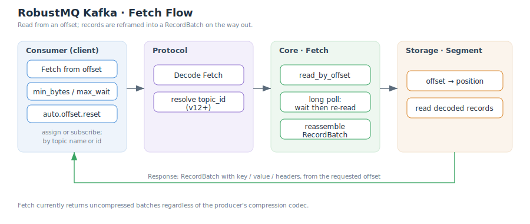

# 消费者

消费者(Consumer)通过 `Fetch` API 从 topic 分区按 offset 读取消息。RobustMQ 兼容标准 Kafka 消费者:两种订阅方式、位点重置策略、长轮询拉取、以及 key/value/header 的完整往返。消费组相关的协调流程见[消费组](./ConsumerGroup.md)。

## 两种订阅方式

| 方式 | API 语义 | 说明 |
|---|---|---|
| `assign(partitions)` | 手动指定分区 | 客户端自己决定读哪些分区,不加入消费组,无再均衡 |
| `subscribe(topics)` | 加入消费组 | 由协调器分配分区,支持再均衡(见[消费组](./ConsumerGroup.md)) |

## 起始位点:auto.offset.reset

当消费者对某分区**没有已提交位点**(首次消费,或位点已过期)时,`auto.offset.reset` 决定从哪里开始:

| 取值 | 起点 |
|---|---|
| `earliest` | 从最早可用 offset 开始 |
| `latest` | 从最新 offset 开始(只读之后新写入的消息) |

若已有已提交位点,则从该位点继续,`auto.offset.reset` 不生效。位点的提交与管理见[位点管理](./OffsetManagement.md)。

## Fetch 流程

一次 `Fetch` 请求的处理:

1. **解码**:协议层解出请求;Fetch v12+ 用 topic_id(UUID)标识 topic,Broker 反解为 topic 并在响应中回填 topic_id。
2. **按 offset 读取**:存储层用 offset→position 索引定位,读取解码后的 record。
3. **长轮询**:若可读数据不足,Broker 等待(见下节)。
4. **重组 RecordBatch**:把解码 record 重新组装成 Kafka `RecordBatch` 返回。

## 长轮询(long poll)

`Fetch` 请求带两个控制参数:

| 参数 | 含义 |
|---|---|
| `min_bytes` | 期望至少返回的字节数 |
| `max_wait` | 最长等待时间 |

RobustMQ 的长轮询是**一次"等待后重读"**:若首次读取的数据量不满足 `min_bytes`,则最多等待 `max_wait` 后再读一次,然后返回。这样在无新消息时避免空转,又能在 `max_wait` 内尽快响应新到达的数据。

## 消息往返

消费者读到的每条 record 保留完整字段:

| 字段 | 说明 |
|---|---|
| key | 原样返回 |
| value | 原样返回 |
| headers | 原样返回 |
| offset | 存储层分配的连续 offset |

> **压缩**:无论生产侧用何种压缩,`Fetch` 目前**固定返回未压缩批次**(见[生产者 · 压缩](./Producer.md#压缩))。

## 相关文档

- [消费组](./ConsumerGroup.md)
- [新一代消费组协议(KIP-848)](./ConsumerGroupNext.md)
- [位点管理](./OffsetManagement.md)
- [生产者](./Producer.md)
- [系统架构](./SystemArchitecture.md)
