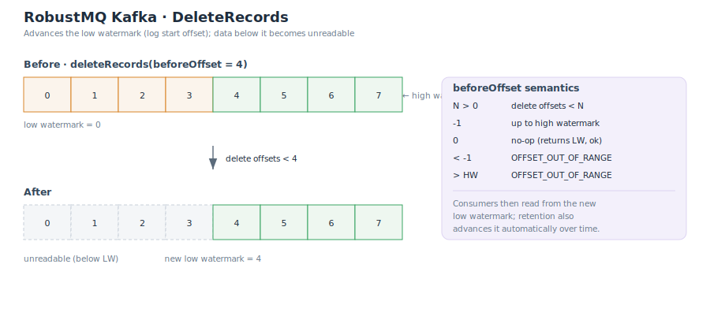

# DeleteRecords(删除记录)

`DeleteRecords` 用于**推进分区的低水位(low watermark)**:把某个 offset 之前的记录标记为不可读并回收空间。它删除的是日志前缀,而不是消费位点(消费组位点删除是另一条路径,勿混淆)。

> 在 RobustMQ 内部,"低水位"就是 shard 的 `earliest_offset`;读取层将其暴露为 `start_offset`,Kafka 协议中称为 `low_watermark`——三者是同一个值。



## beforeOffset 语义

每个分区带一个 `beforeOffset`,取值语义如下:

| `beforeOffset` | 行为 | 返回 |
|---|---|---|
| `N > 0` | 删除 offset `< N` 的记录 | 新低水位 = 达成值 |
| `-1` | 删除到 **high watermark**(删光当前可读数据) | 新低水位 |
| `0` | 空操作:不删除,返回当前低水位 | 成功(error_code 0) |
| `< -1`(其它负数) | 非法 | `OFFSET_OUT_OF_RANGE` |
| `> high watermark` | 越界 | `OFFSET_OUT_OF_RANGE` |
| 未知 topic/分区 | — | `UNKNOWN_TOPIC_OR_PARTITION` |

> 注意 `0` 与 `<-1` 的区别:`beforeOffset = 0` 是返回成功的空操作;而 `-2` 等其它负数会返回 `OFFSET_OUT_OF_RANGE`,并非 no-op。

## 执行过程

1. Broker 解析每个分区的目标 offset:`-1` 解析为该分区的 high watermark;`>HW` 记为越界。
2. 目标传到存储层:目标先被**钳制到 latest**;若 `目标 <= earliest`(已删过或更小),直接返回当前低水位,不做删除。
3. 否则删除 `[earliest, target)` 区间的记录,并把 `earliest_offset` 前移到 `target`——低水位由此推进。

### 物理回收的粒度

低水位会**精确**推进到 `target`,但底层磁盘空间的回收是**按段(segment)粒度**的:

- File Segment 引擎只删除**完全落在 `target` 之前的、已封存(sealed)的段**;
- **绝不删除活跃段**;
- 若 `target` 落在某个仍需保留的段中间,该段整体保留,`>= target` 的记录仍在磁盘上,只是低于低水位而不可读。

因此逻辑可读范围立即收缩,而磁盘释放要等整段都低于低水位。

## 删除后的消费行为

删除后,消费者从**新的低水位**开始读取。若消费者请求的 offset 已低于新低水位,将得到 `OFFSET_OUT_OF_RANGE`,需按其 `auto.offset.reset` 策略重定位(通常回到最早可读 offset)。

## 与 retention 的关系

`DeleteRecords` 是**手动、即时**地推进低水位;而基于时间/大小的 **retention** 是**后台、自动**地做同样的事(删除过期或超限的旧段并前移低水位)。两者推进的是同一个低水位,可以叠加使用:retention 负责常态清理,`DeleteRecords` 用于按需(如合规删除、快速释放)立即截断。

## CLI 示例

```bash
# 删除 topic orders 分区 0 中 offset < 1000 的记录
kafka-delete-records.sh --bootstrap-server localhost:9092 \
  --offset-json-file delete.json
```

`delete.json`:

```json
{
  "partitions": [
    { "topic": "orders", "partition": 0, "offset": 1000 }
  ],
  "version": 1
}
```

> 存储引擎的段结构与低水位机制见 [存储引擎](./Storage.md)。
