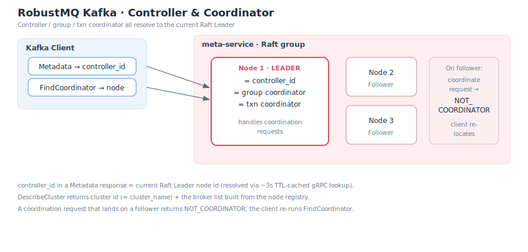

# 集群与 Controller

在原生 Kafka 中,Controller 是集群里被选举出来负责元数据与协调的特殊 broker(KRaft 或早期的 ZooKeeper 选举)。RobustMQ 复用自身基于 Raft 的 meta-service:**Controller 与各类 Coordinator 都定位到当前的 Raft Leader**,无需独立的 Controller 选举。

## Controller = Raft Leader

- 客户端 `Metadata` 响应中的 `controller_id` 返回**当前 Raft Leader 的节点 id**。
- 若暂时无法确定 Leader,`controller_id` 返回 `-1`,客户端会稍后重试。
- Leader 的定位经由一次 gRPC 查询获得,并带约 **3 秒 TTL 缓存**,避免每个请求都打到 meta。缓存过期会自动刷新;短暂过期也能自愈(见下文 `NOT_COORDINATOR`)。

## Coordinator 同理定位

消费组协调器(group coordinator)与事务协调器(transaction coordinator)采用同一套逻辑:

- `FindCoordinator` 返回当前 Leader 节点作为协调器,并给出其可直连的 host:port(取自[节点注册表](./AdvertisedListeners.md))。
- 只有当前 Leader 节点承担协调职责。若一个协调请求(如 `JoinGroup`、`Heartbeat`)落到了**非 Leader 节点**,该节点返回 `NOT_COORDINATOR`。
- 客户端收到 `NOT_COORDINATOR` 后会重新执行 `FindCoordinator` 重定向到正确节点。因此即便缓存短暂过期指向了旧 Leader,流程也能自动纠正。

## DescribeCluster

`DescribeCluster` 返回:

| 字段 | 值 |
|---|---|
| cluster id | 集群名(`cluster_name`,来自 `config/server.toml`) |
| controller id | 当前 Raft Leader 节点 id |
| brokers | 由节点注册表构建的 broker 列表(各节点 id + 广告地址) |

## 与原生 Kafka 的差异

| 维度 | 原生 Kafka | RobustMQ |
|---|---|---|
| Controller 来源 | KRaft / ZooKeeper 选举 | meta-service Raft Leader |
| Coordinator 定位 | 按 group / txn 哈希到某 broker | 统一定位到 Raft Leader |
| Leader 变更后 | 客户端刷新元数据 | 同左;`NOT_COORDINATOR` 触发重定向 |

相关文档:[系统架构](../SystemArchitecture.md) · [广告地址机制](./AdvertisedListeners.md)。
