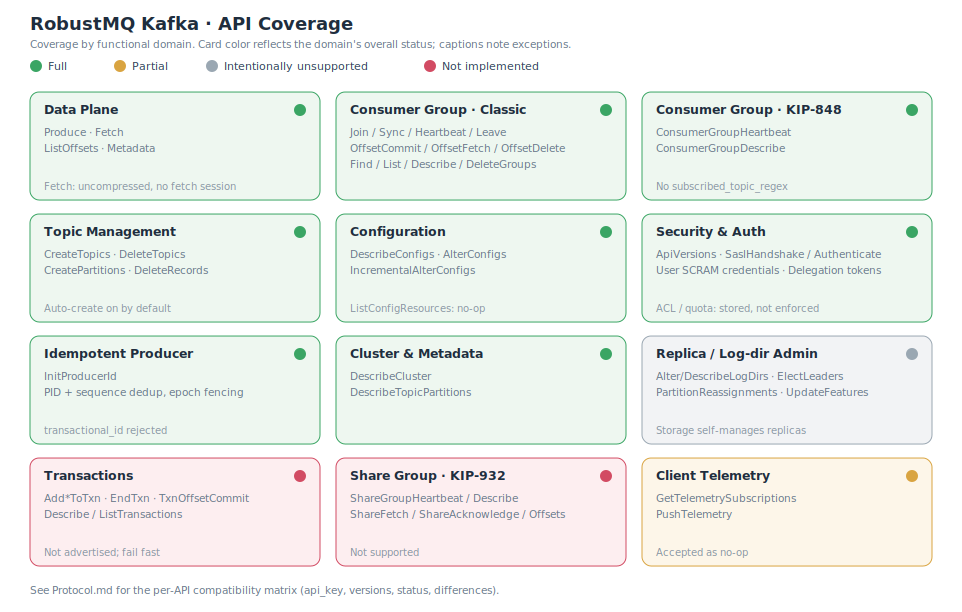

# 协议兼容矩阵

本文逐 API 列出 RobustMQ Kafka 的兼容情况:支持的版本范围、实现状态,以及与原生 Kafka 的差异。这是判断你的客户端 / 工具能否直连的权威依据。

## 状态图例

| 图标 | 含义 |
|---|---|
| ✅ | **完整**:按协议语义实现,可直接使用 |
| 🟡 | **部分**:已通告并接受请求,但语义有裁剪(如 no-op、不强制) |
| ⚪ | **刻意不支持**:返回明确错误而非崩溃,设计上不提供 |
| ❌ | **未实现**:不在 `ApiVersions` 中通告,客户端使用会快速失败 |

> "支持版本"指 RobustMQ 在 `ApiVersions` 中通告的版本范围;未标注版本处表示按客户端协商版本处理。

## 数据面

| Key | API | 支持版本 | 状态 | 差异 / 说明 |
|---|---|---|---|---|
| 0 | Produce | v0–7 | ✅ | 支持幂等写;事务写被拒绝;`LogAppendTime` 未应用 |
| 1 | Fetch | v4–13 | ✅ | 消费侧固定返回未压缩记录;无增量 fetch session;`partition_leader_epoch=0`;无 `read_committed` |
| 2 | ListOffsets | v0–6 | ✅ | earliest / latest / 按时间戳 |
| 3 | Metadata | v0–12 | ✅ | 默认自动创建 topic(`auto.create.topics.enable`) |

## 消费组(经典协议)

| Key | API | 支持版本 | 状态 | 差异 / 说明 |
|---|---|---|---|---|
| 8 | OffsetCommit | — | ✅ | 提交消费位点 |
| 9 | OffsetFetch | — | ✅ | v8 支持多 group 批量查询 |
| 10 | FindCoordinator | v0–4 | ✅ | group 与 transaction 都返回协调器;事务在后续 API 快速失败 |
| 11 | JoinGroup | v0–6 | ✅ | 加入组、触发 rebalance |
| 12 | Heartbeat | — | ✅ | 维持成员资格 |
| 13 | LeaveGroup | — | ✅ | 主动离组 |
| 14 | SyncGroup | — | ✅ | 同步分区分配 |
| 15 | DescribeGroups | — | ✅ | 查询组状态 |
| 16 | ListGroups | — | ✅ | 列出所有组 |
| 42 | DeleteGroups | — | ✅ | 删除组 |
| 47 | OffsetDelete | — | ✅ | 删除已提交位点 |

## 消费组(KIP-848,下一代)

| Key | API | 支持版本 | 状态 | 差异 / 说明 |
|---|---|---|---|---|
| 68 | ConsumerGroupHeartbeat | v0–1 | ✅ | 服务端分配;**不支持** `subscribed_topic_regex` |
| 69 | ConsumerGroupDescribe | v0–1 | ✅ | 查询新一代消费组 |

## 幂等 Producer

| Key | API | 支持版本 | 状态 | 差异 / 说明 |
|---|---|---|---|---|
| 22 | InitProducerId | v0–3 | ✅ | 仅幂等;带 `transactional_id` 返回 `TRANSACTIONAL_ID_AUTHORIZATION_FAILED` |

## 认证与握手

| Key | API | 支持版本 | 状态 | 差异 / 说明 |
|---|---|---|---|---|
| 17 | SaslHandshake | v1 | ✅ | 选择 SASL 机制(SCRAM-SHA-256 / SCRAM-SHA-512) |
| 18 | ApiVersions | v0–4 | ✅ | 连接后第一个请求,协商可用 API |
| 36 | SaslAuthenticate | — | ✅ | SASL token 交换 |

## Topic / Partition 管理

| Key | API | 支持版本 | 状态 | 差异 / 说明 |
|---|---|---|---|---|
| 19 | CreateTopics | v0–7 | ✅ | 拒绝手动副本分配(副本由存储层管理) |
| 20 | DeleteTopics | — | ✅ | 删除 topic |
| 21 | DeleteRecords | — | ✅ | `offset > HW` 返回 `OffsetOutOfRange` |
| 37 | CreatePartitions | — | ✅ | 扩分区 |

## 配置管理

| Key | API | 支持版本 | 状态 | 差异 / 说明 |
|---|---|---|---|---|
| 32 | DescribeConfigs | — | ✅ | 查询配置 |
| 33 | AlterConfigs | — | ✅ | 修改配置 |
| 44 | IncrementalAlterConfigs | — | ✅ | 增量修改配置 |
| 74 | ListConfigResources | — | 🟡 | no-op:通告但不返回资源 |

> 配置多数**可存储但不强制**,详见 [兼容性与限制](./Compatibility-and-Limitations.md)。

## 集群与运维

| Key | API | 支持版本 | 状态 | 差异 / 说明 |
|---|---|---|---|---|
| 60 | DescribeCluster | — | ✅ | 集群信息 |
| 75 | DescribeTopicPartitions | v0 | ✅ | topic partition 详情 |
| 61 | DescribeProducers | — | ❌ | 不通告 |
| 34 | AlterReplicaLogDirs | — | ⚪ | 刻意不支持(返回错误,不崩溃) |
| 35 | DescribeLogDirs | — | ⚪ | 刻意不支持 |
| 43 | ElectLeaders | — | ⚪ | 刻意不支持(leader 由存储层管理) |
| 45 | AlterPartitionReassignments | — | ⚪ | 刻意不支持(副本自动管理) |
| 46 | ListPartitionReassignments | — | ⚪ | 刻意不支持 |
| 57 | UpdateFeatures | — | ⚪ | 刻意不支持 |

## 安全:ACL / 配额 / SCRAM 凭据

| Key | API | 支持版本 | 状态 | 差异 / 说明 |
|---|---|---|---|---|
| 29 | DescribeAcls | — | ✅ | 查询 ACL(**不参与鉴权强制**) |
| 30 | CreateAcls | — | ✅ | 创建 ACL(不强制) |
| 31 | DeleteAcls | — | ✅ | 删除 ACL(不强制) |
| 48 | DescribeClientQuotas | — | ✅ | 查询配额(仅 `client-id`,**不参与限流**) |
| 49 | AlterClientQuotas | — | ✅ | 修改配额(不强制) |
| 50 | DescribeUserScramCredentials | — | ✅ | 查询 SCRAM 凭据 |
| 51 | AlterUserScramCredentials | — | ✅ | 增删 SCRAM 凭据(SASL 认证据此校验) |

## 委托令牌

| Key | API | 支持版本 | 状态 | 差异 / 说明 |
|---|---|---|---|---|
| 38 | CreateDelegationToken | — | ✅ | 元数据管理;令牌**不参与认证** |
| 39 | RenewDelegationToken | — | ✅ | 续期(元数据) |
| 40 | ExpireDelegationToken | — | ✅ | 过期(元数据) |
| 41 | DescribeDelegationToken | — | ✅ | 查询(元数据) |

## 客户端遥测(KIP-714)

| Key | API | 支持版本 | 状态 | 差异 / 说明 |
|---|---|---|---|---|
| 71 | GetTelemetrySubscriptions | — | 🟡 | no-op:接受但不下发订阅 |
| 72 | PushTelemetry | — | 🟡 | no-op:接受但不处理指标 |

## 事务(不支持)

以下 API **不在 `ApiVersions` 中通告**,客户端启用事务会快速失败。

| Key | API | 状态 |
|---|---|---|
| 24 | AddPartitionsToTxn | ❌ |
| 25 | AddOffsetsToTxn | ❌ |
| 26 | EndTxn | ❌ |
| 28 | TxnOffsetCommit | ❌ |
| 65 | DescribeTransactions | ❌ |
| 66 | ListTransactions | ❌ |

> `FindCoordinator` 会为 transaction 返回协调器,但随后的事务 API 立即失败;`InitProducerId` 仅支持幂等模式。

## Share Group(KIP-932,不支持)

Share Group 相关 API 全部 **❌ 未支持**(`ShareGroupHeartbeat` / `ShareGroupDescribe` / `ShareFetch` / `ShareAcknowledge` / `DescribeShareGroupOffsets` / `AlterShareGroupOffsets` / `DeleteShareGroupOffsets` 等)。

## 延伸阅读

- [核心概念](./KafkaCoreConcepts.md)
- [兼容性与限制](./Compatibility-and-Limitations.md) — 差异的根因说明
- [CLI 操作指南](./CLI-Guide.md)
