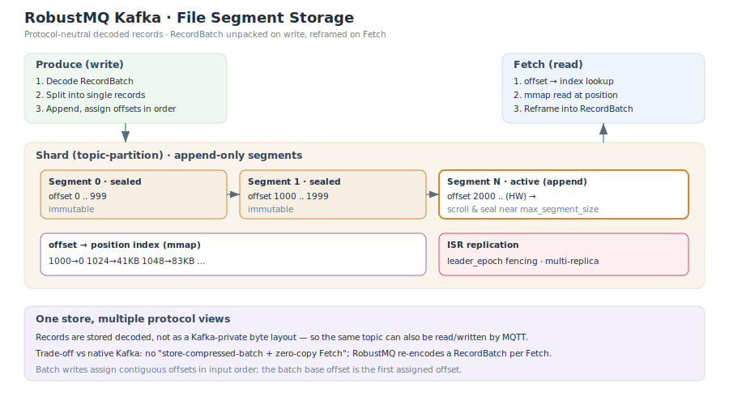

# 存储引擎

RobustMQ Kafka 的消息持久化由统一的 **File Segment 存储引擎**承担。与原生 Kafka 最本质的区别是:存储层保存的是**协议中立的、已解码的消息记录**,而不是 Kafka 私有的压缩字节批次。这使得同一份数据可以被 Kafka 与 MQTT 等多种协议共享读写。



## 段(Segment)

每个 topic-partition(内部称 shard)的数据被切分为一系列**追加写**的段文件,文件路径形如 `{data_fold}/{shard}/{segment_no}.msg`:

- **追加写**:活跃段(active segment)以 `append` 方式顺序写入。
- **滚动(scroll)与封存(seal)**:满足条件时创建新段并封存旧段。触发条件是**两个门槛的组合**,并非简单"写满即滚":
  - 写入 offset 达到滚动步长(每 10000 个 offset 检查一次);
  - 且当前段大小超过 `max_segment_size` 的约 **90%**。
  满足后向 meta-service 申请下一个段(带重试),新段的起始 offset 为 `上一段末尾 + 1`,旧段被封存为不可变。
- **段大小上限**:每个 shard 的 `max_segment_size`(默认 **1 GiB**);集群级默认值由存储配置的 `max_segment_size` 提供。

单条记录的磁盘布局(大端)为固定 24 字节头 + 三段变长数据:

```
offset(u64) | total_len(u32) | metadata_len(u32) | metadata
            | protocol_data_len(u32) | protocol_data | data_len(u32) | data
```

## offset → position 索引与 mmap 读

读取分两级定位:

1. **段范围索引**:先按 offset 落到具体的段(`SegmentOffsetIndex`,按 offset 区间映射段序号)。
2. **段内位置索引**:段内维护持久化的 `offset → 字节位置` 索引(RocksDB),读取时做 **floor seek**(定位到不大于目标 offset 的最近条目),得到一个起始字节位置。

拿到起始位置后,引擎通过 **mmap**(`memmap2`)映射整段文件,从该位置向前扫描记录,跳过 `offset < start_offset` 的记录,直到达到 `max_size`(数据字节数)或 `max_record` 上限。写入 flush 后会失效 mmap 缓存,保证下次读取重新映射到最新数据。

## 批量写与 offset 分配

批量写入时,引擎读取 shard 当前的最新 offset 作为起点,**按输入列表顺序**为每条记录依次分配连续 offset(`offset, offset+1, …`),写完后把 `最大 offset + 1` 保存为新的最新 offset。因此:

- 同一批次内 offset 严格连续且与输入顺序一致;
- Produce 响应的 base offset 就是该批次分配到的第一个 offset。

> 历史上曾因响应从 `HashMap` 构造导致 base offset 被打乱,现已通过按 offset 排序修正,并有回归测试锁定顺序。

## ISR 多副本与 leader_epoch fencing

- **多副本复制**:写入先到该段的 leader;非 leader 收到写入会转发给 leader。`acks=all`(-1)时,若 ISR 数量小于 `min_in_sync_replicas` 返回 `NotEnoughReplicas`,并等待 high watermark 推进到本次写入。
- **leader_epoch fencing**:每次 leader 变更递增 epoch,记录 `(epoch, start_offset)` 到持久化的 `LeaderEpochCache`。`OffsetsForLeaderEpoch` 请求据此判定:请求 epoch 小于当前则 `Fenced`,大于当前则 `Unknown`,相等则返回该 epoch 的结束 offset 作为 follower 的截断点,从而防止脑裂导致的日志分叉。

## 协议中立存储:写解、读重组

这是 RobustMQ 与原生 Kafka 的核心差异所在:

- **Produce(写)**:`RecordBatch` 被完整解码,展开成一条条独立记录后入库(生产者身份取自批次首条记录用于幂等校验)。
- **Fetch(读)**:从存储读出记录后,**重新编码**为一个 **v2、无压缩**的 `RecordBatch` 返回给客户端。

## 与原生 Kafka 的差异及原因

| 维度 | 原生 Kafka | RobustMQ |
|---|---|---|
| 存储单元 | 原样存储压缩后的 RecordBatch | 协议中立的解码记录 |
| Fetch 路径 | zero-copy 直接下发原始批次 | 读出记录后重组为 v2 无压缩 RecordBatch |
| 压缩 | 保留客户端压缩编码 | 存储层不保留原压缩批次 |
| 多协议 | 仅 Kafka | Kafka / MQTT 共享同一份数据 |

**为什么这样设计?** 因为 RobustMQ 的目标是"一份数据、多协议视图":若原样保存 Kafka 私有的压缩批次,MQTT 等协议就无法读懂同一份数据。以"重组"换取"多协议互通"是有意的权衡——代价是放弃 Kafka 的 zero-copy 与压缩透传。

> 相关:低水位推进与记录删除见 [DeleteRecords](./DeleteRecords.md);整体分层见 [系统架构](./SystemArchitecture.md)。
